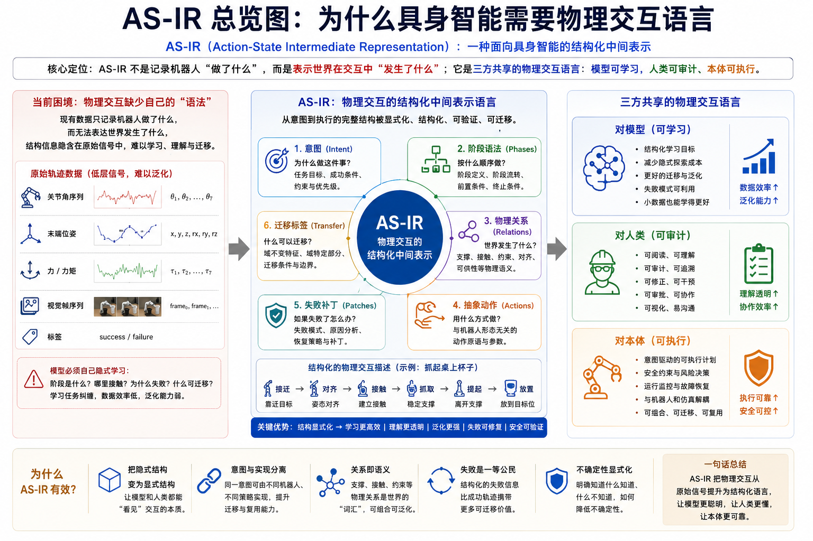
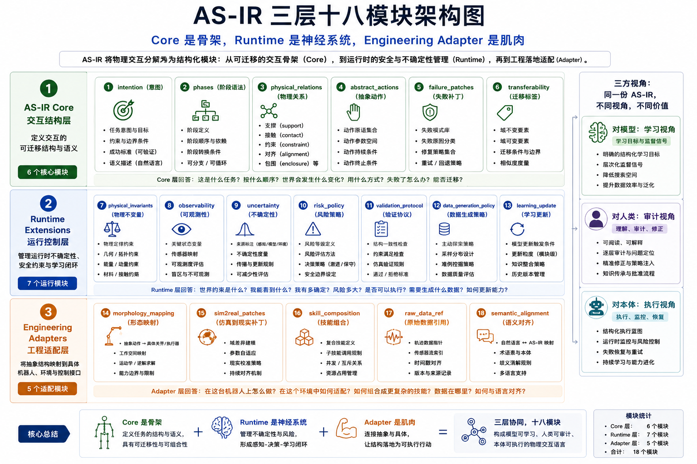
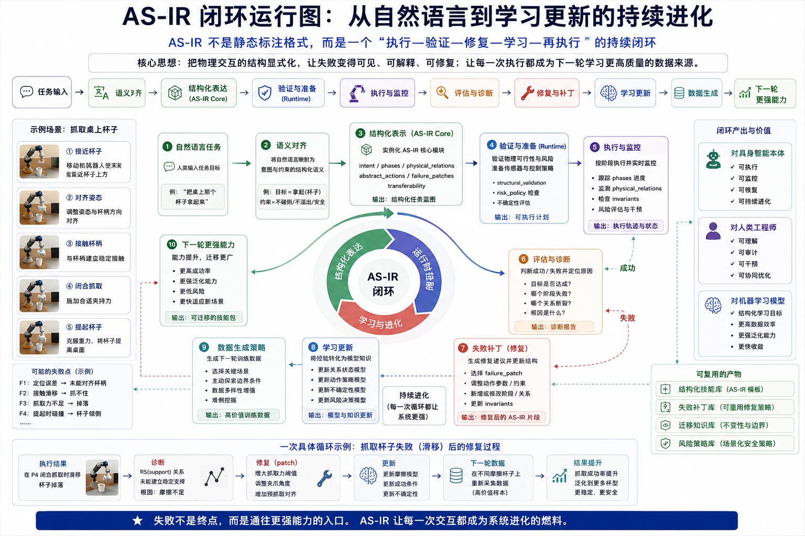

# PILa / AS-IR Cup-Grasp MVP v0.5

**PILa = Physical Interaction Language (物理交互语言层)**
**AS-IR = Action-State Intermediate Representation (行动—状态中间表示层)**

## 核心定位

这是一个演示**物理交互运行时语义追踪**的最小研究原型。

PILa **不是** JSON schema、数据格式标准、报告生成器或失败诊断工具。
AS-IR **不是** 失败报告生成器、日志记录系统、数据可视化工具或事后分析器。

**PILa / AS-IR 是什么**：
- ✅ PILa：定义物理交互的**语义层**（"物理交互中有什么样的意义结构"）
- ✅ AS-IR：运行时**结构化状态轨迹**（"从人类意图到物理反馈的完整语义链路"）
- ✅ 让 VLA / World Model / RL / Controller 的过程更可观测、可验证、可修复
- ✅ 从"黑盒执行"变为"可审计的语义过程"

**当前 MVP 展示**：
- 8 个阶段的**Stage-by-Stage Physical Interaction Runtime Trace**
- 基于证据的**Failure Hypothesis**（而非绝对因果）
- 结构化的**Patch Suggestion** 与 **Next Action Recommendation**
- **跨机器人概念性映射**（Embodiment Adapter）

---

## 架构概览

## Architecture Overview

### Why Embodied Intelligence Needs Physical Interaction Language


### Three-Layer, 18-Module Architecture


### Closed-Loop Runtime System


## 本 Demo 测试什么

**Version**: v0.5-stage-by-stage-trace

本 demo 测试 PILa 的核心假设：

> 原始轨迹数据记录"机器人做了什么"，
> 而 AS-IR 通过 PILa 语义表达"物理交互中发生了什么"。

**本 demo 能够证明**：
- ✅ 结构化物理交互表示的可行性
- ✅ 阶段化状态追踪的概念（Stage P0-P8）
- ✅ 失败假设生成和验证流程
- ✅ 跨机器人的概念性映射

**本 demo 尚未证明**：
- ❌ 完全自动的阶段发现
- ❌ 真实跨机器人迁移
- ❌ 通用具身智能
- ❌ 替代 VLA / World Model / RL / Controller
- ❌ 真实世界的因果证明

---

## 版本历史

### v0.5 (Current)
- **焦点**: Stage-by-Stage Physical Interaction Runtime Trace
- **新增**: 实时语义追踪、基于假设的推理、Next Action Recommendation

### Legacy Notes (v0.3 - v0.4)

以下内容保留用于历史参考，但使用的是旧版术语（legacy terminology）：

**v0.4 (Preserved - Legacy)**
- **焦点**: Failure Diagnosis Report
- **用途**: 事后分析和可视化

> Raw robot trajectories record **what the robot did**, while PILa uses AS-IR to represent **what happened in the physical interaction**.

It does **not** prove PILa solves embodied intelligence. It only tests whether a physical interaction language, implemented through AS-IR, can make failure diagnosis, repair, and learning update more explicit than raw trajectory alone.

**v0.3 adds cross-embodiment meaning transfer:**
the same AS-IR failure trace is interpreted by different robot morphologies (two-finger, three-finger, suction) and re-instantiated into robot-specific patches.

**v0.3.2 adds interactive animations:**
three lightweight CSS/JS animations in the HTML report illustrating the physical interaction timeline, the raw-to-ASIR meaning extraction process, and the cross-embodiment transfer flow.

**v0.3.3 adds bilingual HTML report support:**
- English / 中文 toggle button (top-right)
- Local language preference via localStorage
- Bilingual section headings, explanations, tables and animation labels

The report defaults to English. Use the top-right language switcher to view the Chinese version.

报告默认英文显示，可通过右上角按钮切换为中文。

**v0.4.0 terminology upgrade + animation fix + improved explanations:**

- Renamed the public-facing language to PILa (Physical Interaction Language / 物理交互语言)
- Kept AS-IR as the underlying intermediate representation layer
- Added a glossary explaining PILa, AS-IR, AS-IR Core, Runtime, Engineering Adapter and cross-embodiment meaning transfer
- Fixed physical interaction animation: Patched Lift visually lifts cup, Cup slips shows rotation
- **Improved explanation for Raw Trajectory: Failure vs Patched Run**, clarifying the difference between signal-level changes and AS-IR/PILa structural interpretation with bilingual insight cards

## How to Run

```bash
pip install -r requirements.txt
python run_demo.py
```

Then open:

```
outputs/asir_mvp_report.html
```

## Outputs

| File | Description |
|------|-------------|
| `raw_trajectory_failure.json` | Simulated trajectory — cup slips and falls |
| `raw_trajectory_success.json` | Simulated trajectory — patched, successful grasp |
| `asir_trace_failure.json` | AS-IR structured trace for the failure run |
| `asir_trace_success.json` | AS-IR structured trace for the patched run |
| `patch_report.md` | Markdown report of failure hypotheses, patch suggestions, validation metrics, and learning update |
| `cross_embodiment_transfer.json` | Cross-embodiment meaning transfer output |
| `asir_mvp_report.html` | Full bilingual HTML report with plots, animations, and trace comparison |
| `assets/trajectory_plot.png` | Trajectory comparison plot (embedded in HTML) |

## What to Look For

1. **Raw trajectory** shows low-level signals (forces, distances, scores).
2. **AS-IR trace** represents phases, component states, physical relations, and risk signals explicitly.
3. **Failure hypothesis** identifies evidence-backed candidate explanations and links them to patch suggestions with validation metrics.
4. **Patched run** succeeds — demonstrating the patch suggestion is actionable.
5. **Learning update** records what was learned in structured metadata.
6. **Cross-embodiment transfer** shows the same failure meaning generates different patches for different robots.
7. **Interactive animations** illustrate the interaction timeline, meaning extraction, and cross-embodiment flow with Replay buttons.
8. **Bilingual toggle** switches the report between English and 中文 (Chinese).

## Project Structure

```
asir-cup-grasp-mvp/
├── run_demo.py              # Single-command runner
├── requirements.txt
├── README.md
├── robot_profiles.json      # Robot morphology definitions
├── assets/
│   └── figures/             # Architecture diagrams
│       ├── AS-IR-overview-why-physical-interaction-language.png
│       ├── AS-IR-architecture-3-layers-18-modules.png
│       └── AS-IR-closed-loop-runtime.png
├── src/
│   ├── simulate.py          # Trajectory generation (failure + success)
│   ├── asir_extract.py      # Raw trajectory → AS-IR trace
│   ├── patch_policy.py      # Failure patch extraction and report
│   ├── cross_embodiment.py  # Cross-embodiment meaning transfer
│   └── report.py            # HTML report + matplotlib plots + animations + bilingual
└── outputs/                 # Generated by run_demo.py
    ├── raw_trajectory_failure.json
    ├── raw_trajectory_success.json
    ├── asir_trace_failure.json
    ├── asir_trace_success.json
    ├── cross_embodiment_transfer.json
    ├── patch_report.md
    ├── asir_mvp_report.html
    └── assets/
        └── trajectory_plot.png
```

## Design Principles

- **No real robot needed** — pure Python simulation with fixed random seed
- **No training** — AS-IR extraction is rule-based, not learned
- **No external CDN** — HTML is self-contained, opens locally (animations use vanilla CSS/JS)
- **Reproducible** — `numpy.random.default_rng(42)` ensures same output every run
- **Minimal dependencies** — numpy, matplotlib, jinja2 only

## Roadmap

- Add 3-5 primitive manipulation tasks (pour, place, stack, flip, insert)
- Add AS-IR annotation quality score
- Compare raw trajectory training vs AS-IR-assisted training
- Connect to MuJoCo or Isaac Sim for real physics
- Export AS-IR traces as metadata for LeRobot-style datasets

## License

MIT
