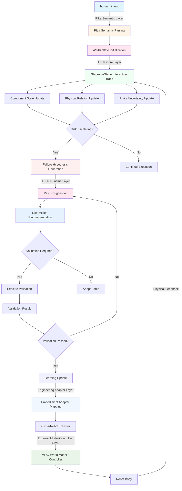

# AS-IR 完整闭环流程 (AS-IR Pipeline Flow)

**版本**: v0.5-stage-by-stage-trace
**创建日期**: 2025-05-20

## 完整数据流



---

## 节点层级归属

### PILa Semantic Layer (PILa 语义层)

- **human_intent**: 人类意图表达
- **PILa Semantic Parsing**: 意图解析为 PILa 语义

### AS-IR Core Layer (AS-IR 核心层)

- **AS-IR State Initialization**: AS-IR 状态初始化
- **Stage-by-Stage Interaction Trace**: 阶段化交互轨迹
- **Component State Update**: 部件状态更新
- **Physical Relation Update**: 物理关系更新
- **Risk / Uncertainty Update**: 风险/不确定性更新

### AS-IR Runtime Layer (AS-IR 运行时层)

- **Failure Hypothesis Generation**: 失败假设生成
- **Patch Suggestion**: 补丁建议
- **Next Action Recommendation**: 下一步行动建议
- **Validation Result**: 验证结果
- **Learning Update**: 学习回写

### Engineering Adapter Layer (工程适配层)

- **Embodiment Adapter Mapping**: 本体适配映射
- **Cross-Robot Transfer**: 跨机器人迁移

### External Model / Controller Layer (外部模型/控制器层)

- **VLA**: 视觉-语言-行动模型
- **World Model**: 世界模型
- **Controller**: 机器人控制器
- **Robot Body**: 机器人本体

---

## 详细阶段说明

### Stage 0: Intent Initialization (意图初始化)

**层级**: PILa Semantic → AS-IR Core

**输入**: 人类意图 (如 "抓起杯子")

**输出**:
```json
{
  "intent": {
    "goal": "pick_up_cup",
    "constraints": ["upright", "no_slip", "safe_force"],
    "success_criteria": {...}
  },
  "asir_initial_state": {
    "phases": ["approach", "contact", "support", "lift"],
    "initial_component_states": {...}
  }
}
```

---

### Stage 1: Approach (接近阶段)

**层级**: AS-IR Core → External Controller

**关键要素**:
- `component_states.gripper_distance`: 递减
- `physical_relations.proximity`: 建立中
- `risk_signals.collision_risk`: 低

**转换条件**: `gripper_distance < threshold`

---

### Stage 2: Contact Establishment (接触建立)

**层级**: AS-IR Core → External Controller

**关键要素**:
- `component_states.contact_force`: 上升
- `physical_relations.contact`: 建立
- `risk_signals.contact_quality`: 评估

**转换条件**: `contact_force > minimum_threshold`

---

### Stage 3: Support Transfer (支撑转移)

**层级**: AS-IR Core → AS-IR Runtime

**关键要素**:
- `component_states.grip_force`: 施加
- `physical_relations.support`: 建立中
- `risk_signals.slip_risk`: 监控

**转换条件**: `support_stable AND slip_risk < threshold`

---

### Stage 4: Lift (提升阶段)

**层级**: AS-IR Runtime → External Controller

**关键要素**:
- `component_states.cup_height`: 上升
- `physical_relations.support`: 维持
- `risk_signals.slip_risk`: 持续监控

**监控条件**: `slip_risk > critical OR tilt_deg > max`

---

### Stage 5: Failure / Risk Escalation (失败/风险升级)

**层级**: AS-IR Runtime Layer, guided by PILa semantics

**关键要素**:
- `risk_signals`: 多维度升级
- `physical_relations.support`: degraded/broken
- `failure_hypothesis`: 生成

**输出**: 候选失败假设列表

---

### Stage 6: Patch Suggestion (补丁建议)

**层级**: AS-IR Runtime Layer, using PILa patch semantics

**关键要素**:
- `patch_suggestion.action`: 具体修复行动
- `patch_suggestion.validation_required`: 是否需要验证
- `next_action_options`: 候选下一步

**约束**: `patch_cost < risk_of_failure`

---

### Stage 7: Validation (验证)

**层级**: AS-IR Runtime → Engineering Adapter

**关键要素**:
- `validation_metrics`: 验证指标
- `validation_result`: 验证结论
- `replay_from_stage`: 重放阶段

**决策**: `adopt_patch OR refine_hypothesis OR try_alternative`

---

### Stage 8: Learning Update (学习回写)

**层级**: Engineering Adapter → PILa Semantic

**关键要素**:
- `learning_update.new_failure_structure`: 新失败结构
- `learning_update.patch_validation`: 补丁验证记录
- `learning_update.adapter_update`: 适配器更新
- `learning_update.next_sampling_policy`: 下次采样策略

---

## 闭环反馈

### 短期闭环 (单个交互)
```
Current Stage → Risk Detection → Patch → Validation → Next Stage
```

### 中期闭环 (单次任务)
```
Task Execution → Failure → Learning → Retry with Patch
```

### 长期闭环 (跨任务/机器人)
```
Multiple Tasks → Failure Structure Library → Cross-Task Transfer
```

---

## 层级职责边界

| 层级 | 职责 | 不涉及 |
|------|------|--------|
| **PILa Semantic** | 定义语义、约束、验证标准 | 具体执行、控制算法 |
| **AS-IR Core** | 状态轨迹、关系维护 | 低级控制、硬件接口 |
| **AS-IR Runtime** | 风险监控、假设生成 | 物理推理、因果证明 |
| **Engineering Adapter** | 本体映射、参数转换 | 本体设计、硬件能力 |
| **External Model/Controller** | 具体行动、物理执行 | 语义表达、可审计性 |

---

**本文档版本**: v0.5
**下一步**: 阅读 `03_code_architecture_review.md`
